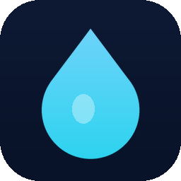

# 💧 Sip — a water reminder that watches you drink

A desktop app that reminds you to drink water on a timer. The twist: **you can't dismiss
the alarm by clicking a button.** When it fires, your camera turns on and the alarm only
clears once it actually **sees you bring a glass to your mouth and drink** for a few seconds.

Everything runs locally on your machine. No accounts, no servers, no video ever leaves
your computer.



---

## Easiest setup (2 steps)

**1. Install Node.js once** — go to <https://nodejs.org> and click the green **LTS**
button, run the installer, done. (This is the only prerequisite.)

**2. Launch Sip:**

| Your computer | Do this |
| --- | --- |
| **macOS / Linux** | Double-click **`start-mac-linux.command`** |
| **Windows** | Double-click **`start-windows.bat`** |

The first launch installs everything automatically (takes ~a minute) and then opens the
app. Every launch after that is instant.

> On macOS the first time, if Finder blocks the `.command` file, right-click it → **Open** →
> **Open**. You only do this once.

That's it. Set your interval, click **Start reminders**, and Sip lives in your menu
bar / system tray from then on.

---

## What it does

- ⏰ **Timer reminders** — a full-screen alarm + chime every *N* minutes (you choose).
- 📷 **Camera verification** — two Google **MediaPipe** AI models run **on your device**:
  one finds your mouth, one tracks your hands. When your hand (holding a cup) is held at
  your mouth for the hold time you set, a progress ring fills and the alarm clears itself.
- 🔔 **Runs in the background** — closing the window tucks it into the menu bar / tray so
  reminders keep coming. Native notifications pop when it's time.
- 🚀 **Launches at login** — on by default; toggle it from the tray menu.
- 🔒 **Private by design** — the camera feed is processed frame-by-frame in memory and is
  never recorded or uploaded.
- 📊 Daily **sips / skips / streak** counter.

Tray menu: **Open · Start · Stop · Remind me now · Launch at login · Quit.**

---

## Build a real installer (optional)

Want a proper `.dmg` / `.exe` / `.AppImage` you (or others) can install without a
terminal? From the `water-reminder` folder:

```bash
npm install
npm run dist          # builds for your current OS into dist/
# or target one explicitly:
npm run dist:mac      # .dmg  (macOS)
npm run dist:win      # .exe installer (Windows)
npm run dist:linux    # .AppImage (Linux)
```

The finished installer lands in `water-reminder/dist/`. Note: the build is **unsigned**,
so the first open may show a Gatekeeper/SmartScreen warning — right-click → Open (macOS)
or "More info → Run anyway" (Windows). Code signing needs a paid Apple/Microsoft
certificate, which is out of scope here.

---

## Manual / developer run

```bash
cd water-reminder
npm install
npm start
```

## Tuning the detection

Open `renderer/index.html` and look near the drinking-detection code:

- `threshold = faceW * 0.85` — how close your hand must get to your mouth to count.
- Hold time is set live in the app UI (default 3 s).

### Honest limitation

Detection is a **gesture proxy** — it confirms *"a hand/cup is held at your mouth for N
seconds,"* which is what drinking looks like. A camera can't chemically prove it's water;
this is the practical ceiling, and in practice faking the motion is more effort than just
taking a sip. A future version could add bottle/cup object-detection for stronger proof.

## Project layout

```
water-reminder/
├─ main.js               Electron main process (window, tray, notifications, login item)
├─ preload.js            Safe bridge to the renderer
├─ renderer/index.html   The whole app UI + detection (also runs as a plain web page)
├─ assets/               App + tray icons
├─ start-mac-linux.command / start-windows.bat   Double-click launchers
└─ package.json          Scripts + electron-builder config
```
